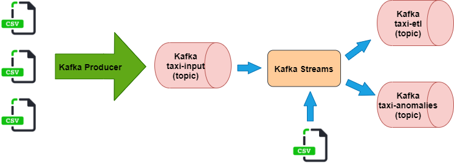

# BigData Kafka Streaming




Download data (they are also into data directory):
```
wget http://www.cs.put.poznan.pl/kjankiewicz/bigdata/stream_project/taxi_zone_lookup.csv
wget http://www.cs.put.poznan.pl/kjankiewicz/bigdata/stream_project/yellow_tripdata_result.zip
unzip yellow_tripdata_result.zip
```
you can also download them from [source page](https://www1.nyc.gov/site/tlc/about/tlc-trip-record-data.page), but there they probably aren't sorted what is required in my program. 

Start broker:
```
systemctl start zookeeper
systemctl start kafka
```

If you want run my programs by IDE you should create proper topic from kafka directory using command:
```
bin/kafka-topics.sh --create --zookeeper localhost:2181 --replication-factor 1 --partitions 1 --topic topic-name
```
run KafkaTaxi and KafkaProducer and use below command to show results topic content:
```
bin/kafka-console-consumer.sh --bootstrap-server localhost:9092 --topic topic-name --property print.key=true --from-beginning
````

Instead of this, you can use scripts and jars wrote by me which are into scripts-jars directory. But you have to properly configure path into scripts and next run them to see results.
